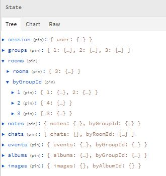
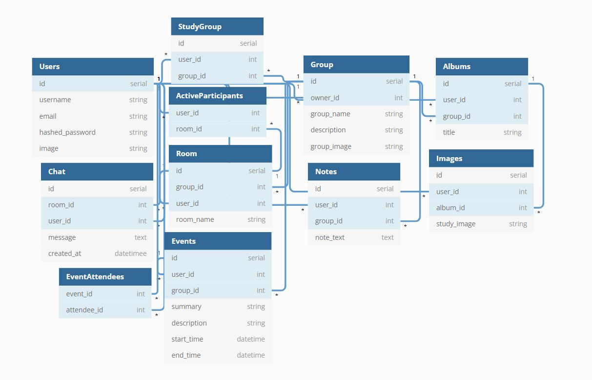

# weStudy


[weStudy](https://we-study-capstone.herokuapp.com) is a social application where users can create and join study groups, chat with other group members, and share notes, images, and events.

This application uses Flask-SocketIO to allow for live chatting between users and live updates of users' online statuses.

| [Live Site](https://we-study-capstone.herokuapp.com) | [MVP Feature List](https://github.com/choi-jihoon/weStudy/wiki/Feature-List-(MVP)) | [Database Schema](https://github.com/choi-jihoon/weStudy/wiki/Database-Schema) | [Frontend Routes](https://github.com/choi-jihoon/weStudy/wiki/Frontend-Routes) | [API Documentation](https://github.com/choi-jihoon/weStudy/wiki/API-Documentation) | [User Stories](https://github.com/choi-jihoon/weStudy/wiki/User-Stories) |

# Technologies Used

weStudy is built on a React / Redux frontend, a Python / Flask backend, and a PostgreSQL database.


It also makes use of socket.io for live chat, AWS S3 for image uploads, and the Google Calendar API to allow users to add events to their personal Google calendar through OAuth.


# Getting started

1. Clone this repository

   ```git clone git@github.com:choi-jihoon/weStudy.git```

2. CD into the /app directory and install dependencies

    ```pipenv install```

3. CD into the /react-app directory and install dependencies

    ```npm install```

4.  Create a .env file in the root directory based on the .env.example given (An AWS S3 account is required for image uploads!)

5.  Create a user in psql based on your .env DATABASE_URL app_name

    ```psql -c "CREATE USER <username> PASSWORD '<password>' CREATEDB"```

6.  Create a databse in psql based on your.env DATABASE_URL app_db_name

7. Start your shell, migrate your database, seed your database, and run the flask app

   ```pipenv shell```

   ```flask db upgrade```

    ```flask seed all```

    ```flask run```

8. Open another terminal and change directory into /react-app and run the React app

	```npm start```

9. In order for the Google Calendar API feature to work, you must get a CLIENT_ID and an API_KEY from your Google Developer console and set up OAuth credentials.


# Features Highlight
## Live Online / Offline Status Updates


weStudy uses the Flask-SocketIO library to emit to all users currently on the app when another user has logged in and when they have logged out without a rerender/refresh. A user's online status can be viewed from the dashboard of a selected study group.

<!--  -->


## Live Chat Messaging


The Flask-SocketIO library is also utilized to broadcast messages within chatrooms so that users can live chat.


```
const sendChat = (e) => {
        e.preventDefault();
        socket.emit('chat', { user: user.username, msg: chatInput, room: room?.id, user_image: user.image });
        dispatch(createChatMessage(roomId, chatInput));
        setChatInput("");
    };

useEffect(() => {
        socket = io();
        socket.emit('join', { 'username': user.username, 'room': room?.id });
        socket.emit('chat', { user: 'weStudy-Bot', msg: `${user.username} has joined the room.`, room: room?.id });

        socket.on('chat', (chat) => {
            setMessages(messages => [...messages, chat]);
            scroll();
        });

        return (() => {
            socket.emit('leave', { 'username': user.username, 'room': room?.id })
            socket.emit('chat', { user: 'weStudy-Bot', msg: `${user.username} has left the room.`, room: room?.id })

            socket.disconnect();
        })
    }, [roomId, room?.id, user.username]);
```

Upon mounting/entering the ChatRoom component, a useEffect makes a call to the backend to Flask-SocketIO's built-in join_room() function as well as the "chat" event to display the message that the user has joined the room.

When the user leaves the room and the component becomes unmounted, the clean-up function in the useEffect makes a call to the backend to broadcast that the user has left the room and disconnects the socket for that user.

The sendChat function emits the message to be broadcasted within the room component the user is currently in, and dispatches the createChatMessage thunk to make an API call to the backend to persist the chat data.


## Full CRUD for Groups, Rooms, Notes, Events, & Albums


Group owners have access to full CRUD for features contained within their group, while group members' edit/delete abilities are limited to items that they have created themselves within the group.

For example, the owner of a group can delete any room, note, event, or album created within the group. A group member can only delete a room, note, event, or album that they have created.

Note: The NOTES feature allows any user to edit and save a note within the group, as the purpose for notes shared within a study group is for them to be a collaborative space. DELETING a note is reserved for the note creator and the group owner.


## Image Sharing with AWS S3


weStudy uses AWS S3 to allow users to upload images from their local computer to add to albums, to set as a group image, and to edit their own profile picture.


## Google Calendar API


The implementation of the Google Calendar API allows users to add created events to their personal Google calendar by signing in with OAuth.

(Currently, this feature is limited to a select number of test emails due to the lack of a Privacy Policy for this app.)


----------------------------------------

# Redux Store State


The Redux store uses a normalized state shape for a time complexity of O(1) when accessing data that's being updated, deleted, and/or rendered.

In addition to being accessible by their unique IDs, rooms, notes, events, and albums are stored by their associated group IDs, chats are stored by their room IDs, and images are stored by their album IDs to optimize load times and reduce the number of fetch calls needed to the backend database.


# Database Schema

## v1.0.0


## v1.1.0


# Conclusion

After 20 weeks as a Full Stack Software Engineering student at App Academy, this capstone project gave me the opportunity to apply and demonstrate what I have learned in:
- creating a database to seamlessly and coherently connect data
- setting up a backend server with user authentication, error handling, and API routes following RESTful conventions
- designing a frontend application with React components and connecting it to the backend
- making full use of the Redux state store to optimize load times

This project also allowed me to explore:
- learning and utilizing socket.io to implement live chat / broadcasting
- integrating an external API (Google Calendar) and the handling of OAuth
- setting up Amazon Web Services S3 to handle image uploads


# Next Steps
- [x] Display of active users in a given chatroom
- [x] Media queries to make the design more responsive to different sized screens, as well as a mobile-friendly (v1.0.1)
- [x] Search for groups by name and request to join (v.1.1.0)
  - [x] Notifications for when a user requests to join a group (v.1.1.0)
- [ ] Collaborative whiteboard
